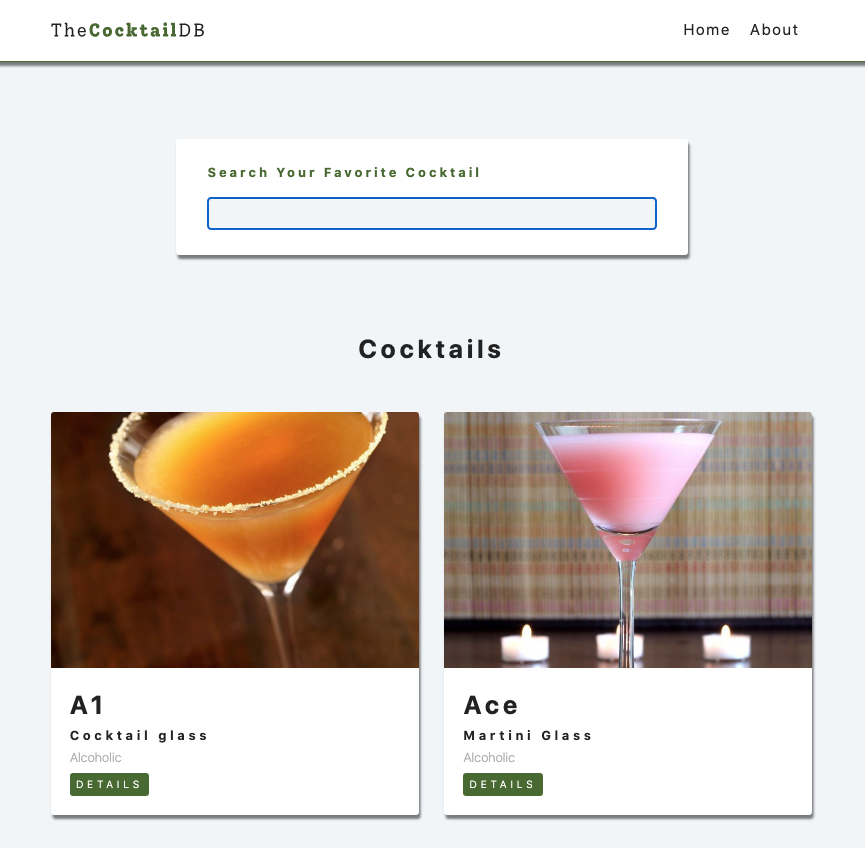

#  Cocktail Picker
A web application to find a cocktail for tonight

## Live Site
[Cocktail Picker](https://my-react-project-cocktails.netlify.app/)

## Table of Contents
[Introduction](#Introduction)

[Motivation](#Motivation)

[Built With](#built-with)

[License](#License)

[Acknowledgements](#Acknowledgements)

## Introduction
This web application is for a user to find a cocktail. It was built using Create React App, The Cocktail DB, and with this video from [Coding Addict](https://youtu.be/ly3m6mv5qvg?t=27597). This app uses a hook to fetch data about cocktails from The Cocktail DB and then display the information. 

It takes advantage of components to create different parts of each part of the app. Also includes features such as a search bar that fetches and displays cocktails as the user enters text. It has multiple pages and uses React Router to create routes between pages. 

## Motivation
I created this project as a way to practice after a React tutorial. I found the Coding Addict youtube channel to have videos about React projects that create a web application from start to finish.I wanted to become more comfortable using React and learning all it can do. The videos were great as they provided a starting point for a project, as well as find any gaps in my knowledge of React.

## Built With
- React
- React Router
- CSS

## License
[MIT](https://choosealicense.com/licenses/mit/)

## Acknowledgements
[Coding Addict](https://youtu.be/ly3m6mv5qvg)
[The Cocktail DB](https://www.thecocktaildb.com/)
[Create React APP](https://create-react-app.dev/)
